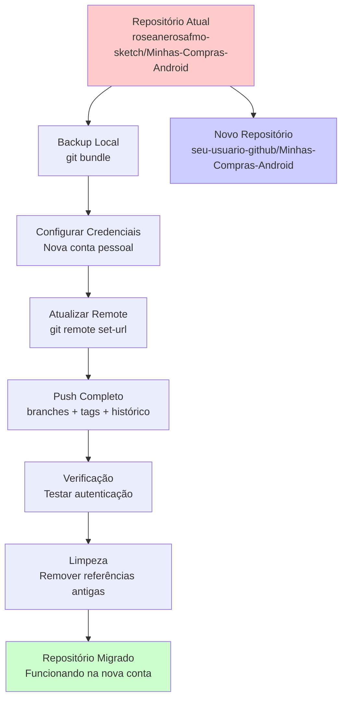
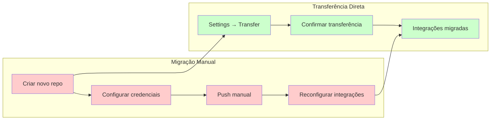
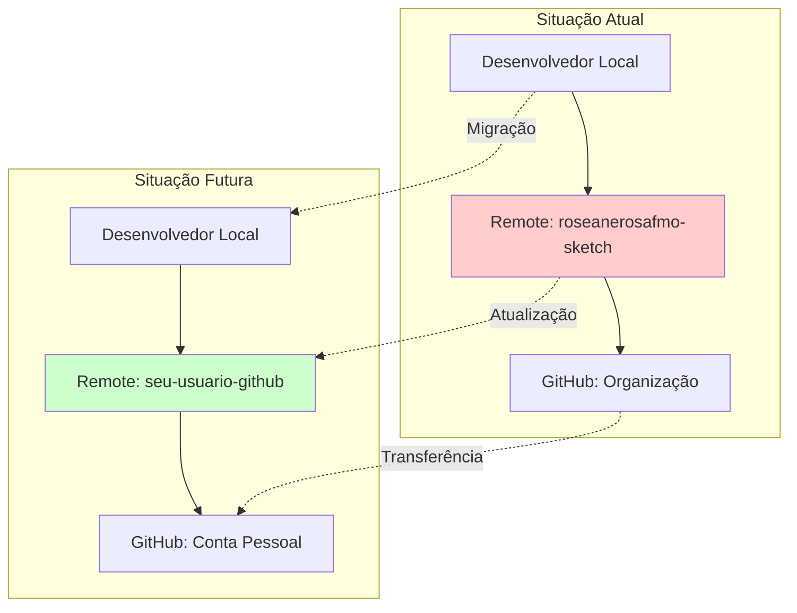

# Diagrama de Migração do Repositório

## Fluxo de Migração



## Comparação: Migração Manual vs Transferência Direta



## Arquitetura Atual vs Futura



## Fluxo de Autenticação

```mermaid
sequenceDiagram
    participant Dev as Desenvolvedor
    participant Git as Git Local
    participant GH as GitHub
    participant Cred as Gerenciador de Credenciais
    
    Dev->>Cred: Remover credenciais antigas
    Dev->>Git: git config --global user.email
    Dev->>Git: git remote set-url origin
    Dev->>Git: git push
    
    Git->>Cred: Solicitar autenticação
    Cred->>GH: Apresentar credenciais novas
    GH-->>Cred: Token de acesso
    Cred-->>Git: Autenticação bem-sucedida
    Git-->>Dev: Push concluído com sucesso