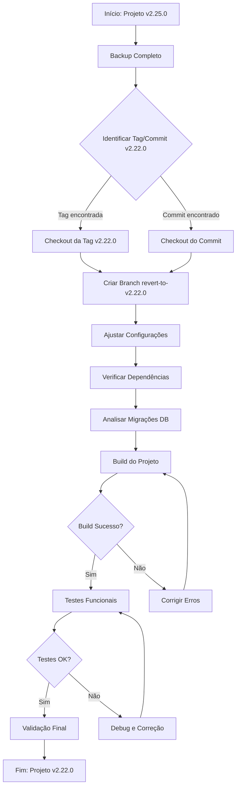
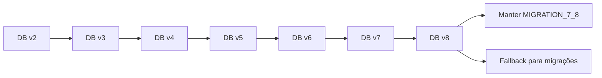

# Diagrama do Processo de Reversão para v2.22.0

## 🔄 Fluxograma do Processo



## 📊 Comparação de Versões

| Aspecto | Versão Atual (2.25.0) | Versão Alvo (2.22.0) | Ação Necessária |
|---------|------------------------|------------------------|-----------------|
| versionCode | 75 | 72 | Reverter para 72 |
| versionName | "2.25.0" | "2.22.0" | Reverter para 2.22.0 |
| Database Version | 8 | 8 | Manter |
| Vico Charts | 1.13.1 | 1.13.1 | Manter |
| Firebase BOM | 33.7.0 | 33.7.0 | Manter |
| Features | Pós-v2.22.0 | Até v2.22.0 | Reverter |

## 🗂️ Estrutura de Arquivos Críticos

```
Minhas-Compras-Android/
├── app/build.gradle.kts           # Configurações de build
├── app/src/main/java/.../data/
│   └── AppDatabase.kt           # Migrações do banco
├── app/src/main/java/.../ui/screens/
│   ├── StatisticsScreen.kt        # Features pós-v2.22.0?
│   └── ...                     # Outras telas
├── RELEASE_NOTES_v2.22.0.md     # Referência da versão
└── app-release-v2.22.0.apk      # APK de referência
```

## ⚡ Pontos Críticos de Atenção

### 1. Migrações de Banco de Dados


### 2. Dependências Críticas
- **Vico Charts**: Essencial para estatísticas da v2.22.0
- **Firebase**: Notificações e updates OTA
- **Room**: Banco de dados local
- **Compose**: Interface do usuário

### 3. Features da v2.22.0
- ✅ Estatísticas Avançadas (gráficos)
- ✅ Total a Pagar Fixo
- ✅ Migrações de banco até v8
- ❌ Features pós-v2.22.0 (serão perdidas)

## 🚨 Riscos e Pontos de Falha

### Alto Risco
- **Perda de dados do usuário**: Backup obrigatório
- **Build failures**: Verificar dependências
- **Crashes no app**: Testes exaustivos

### Médio Risco
- **Performance**: Comparar com APK original
- **Compatibilidade**: Testar em diferentes dispositivos
- **Migrações**: Validar todas as transições

### Baixo Risco
- **Configurações de build**: Fácil de ajustar
- **Dependências**: Versões bem definidas
- **Documentação**: Release notes disponível

## 📋 Checklist de Validação

### Build e Compilação
- [ ] ./gradlew clean sem erros
- [ ] ./gradlew assembleDebug sucesso
- [ ] ./gradlew assembleRelease sucesso
- [ ] APK gerado com versionCode 72
- [ ] APK gerado com versionName "2.22.0"

### Funcionalidades
- [ ] App abre sem crashes
- [ ] Lista de compras funcional
- [ ] Estatísticas avançadas funcionando
- [ ] Total a Pagar comportamento correto
- [ ] Migrações de banco aplicando

### Comparações
- [ ] APK idêntico ao app-release-v2.22.0.apk
- [ ] Assinatura digital válida
- [ ] Performance similar
- [ ] Features da v2.22.0 presentes

## 🔧 Comandos de Emergência

### Se algo der errado:
```bash
# Restaurar backup
cp -r Minhas-Compras-Android-backup-*/* Minhas-Compras-Android/

# Voltar para branch original
git checkout main
git branch -D revert-to-v2.22.0

# Restaurar stash (se houver)
git stash pop
```

### Validação rápida:
```bash
# Verificar versão
grep -r "versionCode\|versionName" app/build.gradle.kts

# Verificar dependências
grep -r "vico" app/build.gradle.kts

# Testar build rápido
./gradlew assembleDebug
```

---

**Nota**: Este diagrama deve ser usado como guia visual durante o processo de reversão. Cada etapa deve ser validada antes de prosseguir para a próxima.