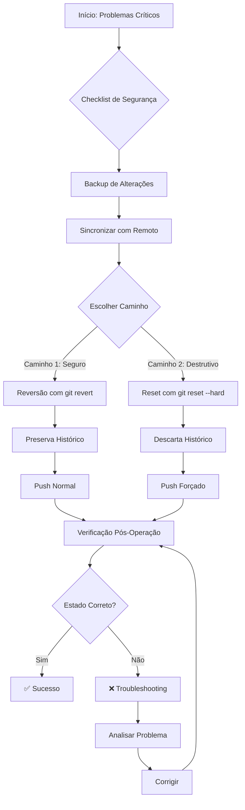

# 🔄 Procedimento Completo: Restauração para Tag 2.16.0

## 📋 Contexto da Operação

**Data:** 18/12/2025  
**Motivo:** Problemas críticos na versão atual  
**Branch Principal:** `main`  
**Tag Alvo:** `v2.16.0` (Version Code: 66)  
**Status:** ⚠️ **EM EXECUÇÃO**

---

## 🛡️ CHECKLIST DE SEGURANÇA OBRIGATÓRIO

### ⚠️ **ANTES DE QUALQUER OPERAÇÃO - EXECUTAR OBRIGATORIAMENTE**

#### 1. Backup de Alterações Locais
```bash
# Verificar se há alterações não commitadas
git status

# SE HOUVER ALTERAÇÕES NÃO COMMITADAS:
# Opção A: Stash (recomendado para alterações temporárias)
git stash push -m "Backup antes de reversão para v2.16.0 - $(date +%Y%m%d_%H%M%S)"

# Opção B: Commit em branch de segurança (recomendado para trabalho importante)
git checkout -b backup-before-revert-$(date +%Y%m%d_%H%M%S)
git add .
git commit -m "Backup de segurança antes de reversão para v2.16.0"
git checkout main
```

#### 2. Verificação de Branches Ativos
```bash
# Listar branches ativos
git branch -a

# Anotar branch atual para retorno se necessário
git branch --show-current
```

#### 3. Sincronização com Repositório Remoto
```bash
# Sincronizar todas as referências remotas
git fetch origin --all --prune

# Verificar últimas atualizações
git log --oneline -5 origin/main
```

---

## 🔄 DOIS CAMINHOS DISTINTOS

### 🛡️ CAMINHO 1: REVERSÃO SEGURA (PRESERVA HISTÓRICO)

**✅ RECOMENDADO PARA:** Branches compartilhados, equipes colaborativas, produção  
**⚠️ VANTAGENS:** Preserva todo o histórico, permite análise futura, operação reversível

#### 1.1 Preparação
```bash
# Garantir que está no branch principal
git checkout main

# Verificar estado atual
git status
git log --oneline -5
```

#### 1.2 Execução da Reversão Segura
```bash
# Criar commit de reversão que preserva o histórico
git revert --no-edit 2.16.0..HEAD

# Se houver conflitos durante o revert:
# 1. Resolver conflitos manualmente
# 2. git add <arquivos-resolvidos>
# 3. git revert --continue

# Se precisar cancelar o revert:
# git revert --abort
```

#### 1.3 Validação e Push
```bash
# Verificar o commit de reversão criado
git log --oneline -3

# Fazer push normal (seguro)
git push origin main
```

#### 1.4 Resultado Esperado
- ✅ Histórico completo preservado
- ✅ Novo commit criado revertendo alterações
- ✅ Operação rastreável e reversível
- ✅ Equipe pode ver o que foi revertido e porquê

---

### ⚠️ CAMINHO 2: RESET DESTRUTIVO (DISCARDA HISTÓRICO)

**⚠️ AVISO CRÍTICO:** ESTE MÉTODO DISCARDA O HISTÓRICO DE COMMITS  
**✅ RECOMENDADO PARA:** Branches locais, desenvolvimento isolado, consentimento explícito da equipe  
**⚠️ RISCOS:** Perda de histórico, conflitos para outros desenvolvedores, operação irreversível

#### 2.1 Preparação
```bash
# Garantir que está no branch principal
git checkout main

# VERIFICAÇÃO CRÍTICA:
echo "⚠️ ATENÇÃO: Você está prestes a descartar histórico de commits!"
echo "Branch atual: $(git branch --show-current)"
echo "Commit atual: $(git rev-parse HEAD)"
echo "Tag alvo: 2.16.0"
echo ""
read -p "Digite 'CONFIRMAR' para prosseguir: " CONFIRMATION

if [ "$CONFIRMATION" != "CONFIRMAR" ]; then
    echo "❌ Operação cancelada pelo usuário"
    exit 1
fi
```

#### 2.2 Execução do Reset Destrutivo
```bash
# Reset para o estado exato da tag 2.16.0
git reset --hard 2.16.0

# Verificar estado após reset
git log --oneline -5
git status
```

#### 2.3 Push Forçado (Seguro)
```bash
# Push forçado com lease (mais seguro que --force)
git push origin main --force-with-lease

# Se houver rejeição por conflitos:
# 1. git fetch origin
# 2. git reset --hard origin/main
# 3. Reavaliar a situação
```

#### 2.4 Resultado Esperado
- ⚠️ Histórico descartado permanentemente
- ✅ Branch no estado exato da tag 2.16.0
- ⚠️ Outros desenvolvedores precisarão fazer pull forçado
- ⚠️ Commits posteriores serão perdidos

---

## 🔍 ETAPA DE VERIFICAÇÃO PÓS-OPERAÇÃO

### 3.1 Verificação do Estado
```bash
# Verificar histórico de commits
git log --oneline -5

# Verificar se está na versão correta
git describe --tags

# Verificar arquivos da versão
cat app/build.gradle.kts | grep -E "(versionCode|versionName)"

# Verificar status do diretório
git status
```

### 3.2 Validação Funcional
```bash
# Verificar se o APK da v2.16.0 existe
ls -la app-release-v2.16.0.apk

# Se necessário, gerar novo APK
./gradlew clean
./gradlew assembleRelease

# Verificar APK gerado
ls -la app/build/outputs/apk/release/app-release.apk
```

### 3.3 Verificação Remota
```bash
# Sincronizar com remoto
git fetch origin

# Comparar local vs remoto
git log --oneline origin/main -3
git log --oneline -3

# Verificar tags disponíveis
git tag --list | grep 2.16
```

---

## 📊 DIAGRAMA DE FLUXO DO PROCESSO



---

## 🚨 RECOMENDAÇÕES DE MELHORES PRÁTICAS

### Antes da Operação
1. **Comunicação:** Informar toda a equipe sobre a reversão planejada
2. **Backup:** Criar backup completo do repositório
3. **Documentação:** Registrar motivos da reversão
4. **Testes:** Validar que a tag 2.16.0 realmente resolve os problemas

### Durante a Operação
1. **Ambiente Isolado:** Realizar operação em ambiente de desenvolvimento
2. **Passo a Passo:** Seguir exatamente o procedimento documentado
3. **Verificação:** Validar cada etapa antes de prosseguir

### Após a Operação
1. **Comunicação:** Informar equipe sobre a conclusão
2. **Documentação:** Atualizar documentação do projeto
3. **Monitoramento:** Acompanhar estabilidade da versão restaurada
4. **Análise:** Investigar causas dos problemas na versão anterior

---

## 🔧 SOLUÇÃO DE PROBLEMAS COMUNS

### Conflitos durante git revert
```bash
# Listar conflitos
git status

# Resolver conflitos manualmente nos arquivos indicados
# Editar arquivos, remover marcadores de conflito

# Marcar como resolvido
git add <arquivo-resolvido>

# Continuar o revert
git revert --continue
```

### Rejeição no push forçado
```bash
# Sincronizar e analisar situação
git fetch origin

# Verificar diferenças
git log --oneline origin/main..HEAD

# Se necessário, fazer pull e reavaliar
git pull origin main --rebase
```

### Branch em estado inesperado
```bash
# Verificar estado atual
git status
git log --oneline -3

# Resetar para estado conhecido (CUIDADO)
git reset --hard origin/main
```

---

## 📞 CONTINGÊNCIA E SUPORTE

### Se algo der errado:
1. **Parar imediatamente** e avaliar situação
2. **Restaurar backup** se disponível
3. **Comunicar equipe** sobre o problema
4. **Documentar** o ocorrido para aprendizado

### Comandos de emergência:
```bash
# Restaurar stash mais recente
git stash pop

# Reset para estado remoto seguro
git reset --hard origin/main

# Verificar operações recentes
git reflog --oneline -10
```

---

## ✅ CHECKLIST FINAL DE VALIDAÇÃO

- [ ] Backup das alterações locais realizado
- [ ] Repositório sincronizado com remoto
- [ ] Caminho escolhido documentado
- [ ] Operação executada conforme procedimento
- [ ] Verificação pós-operação concluída
- [ ] Equipe comunicada sobre resultado
- [ ] Documentação atualizada
- [ ] Monitoramento da versão restaurada iniciado

---

**Status da Reversão:** ⚠️ **EM ANDAMENTO**  
**Responsável:** ________________  
**Data de Conclusão:** ________________  
**Próxima Revisão:** ________________

---

*Este procedimento deve ser seguido rigorosamente para garantir a segurança e integridade do repositório durante a reversão para a versão 2.16.0.*